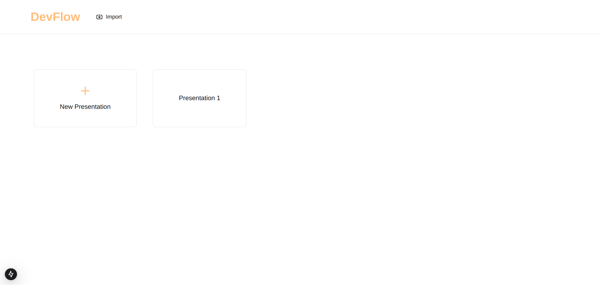
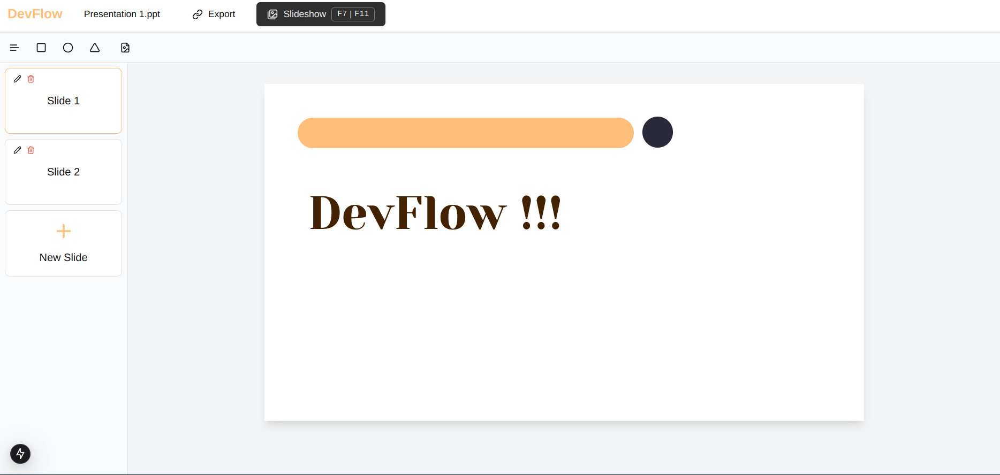
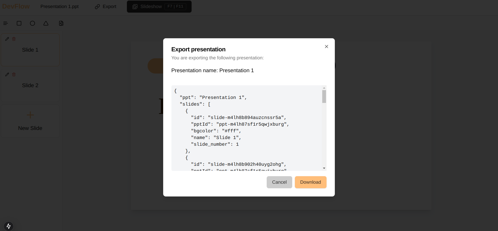

# DevFlow
#### Presentations for developers, by developers
DevFlow is a powerful yet simple presentation platform that empowers you to create stunning presentations effortlessly. With intuitive tools and a user-friendly interface, it’s designed to help you craft your ideas on the go.

### Features
- <b>Interactive Slide Editor</b>: Add, edit and customize slides with ease.
- <b>Shape Tools</b>: Create text boxes, rectangles, circles, or even bring your own images. 
- <b>Positioning Elements</b>: Accurately position elements from the toolbar, or drag the element to where you need it to be.
- <b>Customizable Styles</b>: Adjust colors, fonts and dimensions.
- <b>Presentation Mode</b>: Start a slideshow by using the shortcut key F7 or F11.
- <b>Persistence</b>: All changes are saved automatically on your local machine.

### Getting Started
#### Prerequisites
- Node.js (v16+ recommended)
- npm or yarn

#### Installation
- Clone the repo:
```
git clone https://github.com/xerctia/devflow
cd devflow
```
- Install dependencies:
```
npm install
```
- Start the server:
```
npm run dev
```
- Open your browser and go to http://localhost:3000/

### Shortcuts
- New Presentation: <kbd>Ctrl + Alt + N</kbd></br></br>
- Next Slide: <kbd>Tab</kbd></br></br>
- Previous Slide: <kbd>Shift + Tab</kbd></br></br>
- Start Slideshow: <kbd>F7 or F11</kbd></br></br>
- Exit Slideshow: <kbd>Esc</kbd></br></br>

### Screenshots
#### 1. Home Page

#### 2. Slide Editor

#### 3. Export Presentation


### Technologies Used
- <b>Frontend:</b> Next.js and ShadCN
- <b>Data Storage:</b> IndexedDB with Dexie (saves on local machine)
- <b>Backend + Database:</b> Convex (in development)